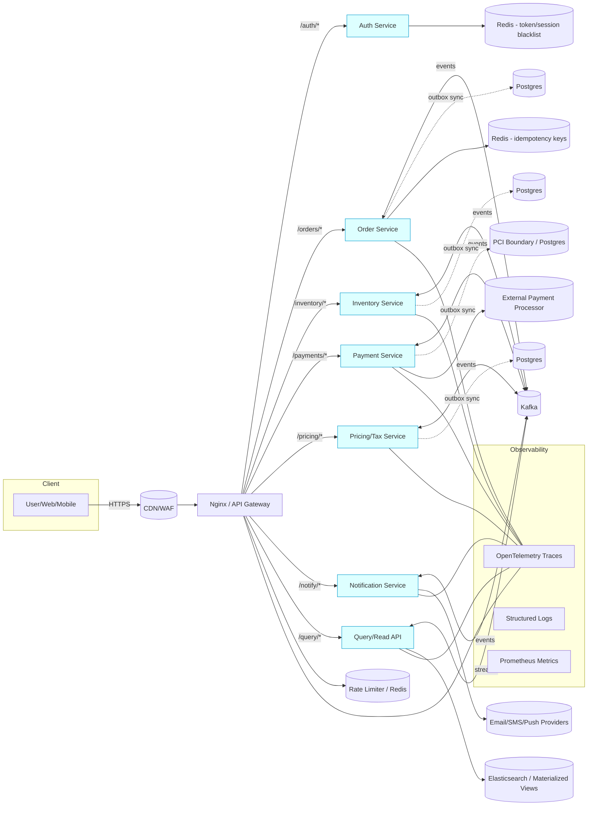

# **Interview Cheat Sheet**

## 1) 🧠 Core Java

### Concurrency & Memory

* **Thread lifecycle:** `new → runnable → running → waiting/blocking → terminated`.
* **ExecutorService:** Use `Callable`/`Future` for managed concurrency.
* **Locks vs synchronized:** Use `synchronized` for most cases (simplicity); prefer `ReentrantLock` only for advanced needs like fairness or interruptible waits.
* **Volatile:** Ensures visibility but not atomicity.
* **Atomic classes:** (`AtomicInteger`, `AtomicReference`) for lock-free counters.
* **CompletableFuture:** Build async pipelines with `thenCompose`/`exceptionally`.
* **ForkJoinPool:** Efficient for recursive parallel tasks.
* **Semaphore:** Controls concurrent access (permits); useful for throttling or limiting resource usage.

```java
CompletableFuture.supplyAsync(() -> fetchData())
    .thenCombine(
        CompletableFuture.supplyAsync(() -> fetchUser()),
        (data, user) -> merge(data, user)
    )
    .exceptionally(ex -> fallback(ex));
// Example: fetchData and fetchUser are methods fetching data asynchronously; merge combines their results.
```

### Functional & Stream APIs

* `Function`, `Predicate`, `Supplier`, `Consumer` — core functional interfaces.
* Use `map`, `filter`, `flatMap`, `reduce`. Prefer parallel streams only when stateless and data-heavy.
* Combine with `Collectors.groupingBy`, `partitioningBy`.

```java
list.stream()
    .filter(u -> u.isActive())
    .collect(Collectors.groupingBy(User::getRole));
```

### Reflection & Classloading

* Use `Class.forName()`, `getDeclaredFields()`, `Method.invoke()` for dynamic inspection.
* Keep reflection minimal — it breaks type safety and impacts performance.
* Custom ClassLoaders can isolate plugin modules or tenants.

### Exception & Immutability

* Use **custom exceptions** for API-level granularity.
* Favor **immutable objects** (`final` fields, no setters) to avoid race conditions.

---

## 2) 🏗️ Data Structures & Use Cases

### Core Collections

| Data Structure | Avg. Time Complexity              | Typical Use / Notes             |
| -------------- | --------------------------------- | ------------------------------- |
| **Array**      | Access: O(1), Insert/Delete: O(n) | Fixed-size, fast random access. |
| **ArrayList**  | Access: O(1), Insert/Delete: O(n) | Dynamic resize, good for reads. |
| **LinkedList** | Access: O(n), Insert/Delete: O(1) | Fast at ends, high overhead.    |

### Maps

| Data Structure        | Avg. Time Complexity      | Typical Use / Notes                     |
| --------------------- | ------------------------- | --------------------------------------- |
| **HashMap**           | Access: O(1), Worst: O(n) | Fast lookup, unordered.                 |
| **ConcurrentHashMap** | Access: O(1)              | Thread-safe, low contention.            |
| **TreeMap**           | Access: O(log n)          | Sorted keys, slower than HashMap.       |
| **LinkedHashMap**     | Access: O(1)              | Predictable order, great for LRU cache. |
| **WeakHashMap**       | Access: O(1)              | Auto-clears when keys are GC’d.         |
| **EnumMap**           | Access: O(1)              | Optimized for enum keys.                |

### Sets

| Data Structure | Avg. Time Complexity | Typical Use / Notes         |
| -------------- | -------------------- | --------------------------- |
| **HashSet**    | Access: O(1)         | Unique, unordered elements. |
| **TreeSet**    | Access: O(log n)     | Sorted unique elements.     |
| **BitSet**     | Access: O(1)         | Space-efficient flags.      |

### Queues & Stacks

| Data Structure           | Avg. Time Complexity    | Typical Use / Notes         |
| ------------------------ | ----------------------- | --------------------------- |
| **Stack / Deque**        | Push/Pop: O(1)          | LIFO operations.            |
| **Queue / Deque**        | Offer/Poll: O(1)        | FIFO or double-ended.       |
| **BlockingQueue**        | Offer/Poll: O(1)        | Thread-safe blocking tasks. |
| **PriorityQueue**        | Insert/Delete: O(log n) | Min/max retrieval.          |
| **CopyOnWriteArrayList** | Read: O(1), Write: O(n) | Safe concurrent reads.      |

---

## 3) 🍃 Spring Boot Mastery

### Architecture & Validation

* **Controller:** REST entry point (`@RestController`, `@RequestMapping`).
* **Service:** Business logic.
* **Repository:** Data layer.
* **DTO:** Transfer objects, decoupled from persistence.
* **Validation:** `@Valid`, `@NotNull`, `@Pattern` via `spring-boot-starter-validation`.

### Annotation Reference

| Annotation | Purpose / Use Case | Notes |
|:-----------|:-------------------|:------|
| **@RestController** | Combines `@Controller` + `@ResponseBody` to expose REST APIs. | Auto-serializes to JSON/XML. |
| **@Controller** | Handles web requests, returns views (MVC). | Use with `ModelAndView`. |
| **@Service** | Marks business logic beans. | Singleton by default. |
| **@Repository** | DAO layer, translates SQL exceptions. | Used for JPA/JDBC. |
| **@Configuration** | Declares bean definitions. | Type-safe alt to XML. |
| **@Bean** | Defines a Spring-managed bean. | Lifecycle-aware, injectable. |
| **@Value("${property}")** | Injects config/env values. | Supports SpEL (`#{}`) syntax. |
| **@Transactional** | Defines DB transaction boundaries. | Supports rollback/isolation. |
| **@Profile("prod")** | Loads beans under specific env profile. | Common: `dev`, `test`, `prod`. |
| **@DependsOn("bean")** | Enforces bean init order. | Handles implicit dependencies. |
| **@ConditionalOnProperty** | Loads bean if config flag matches. | Feature toggles. |
| **@ConditionalOnMissingBean** | Loads bean only if not defined. | Avoids duplicates. |
| **@Lazy** | Delays bean creation. | Improves startup time. |
| **@Scope("prototype")** | Creates new instance per injection. | Default scope: singleton. |
| **@Cacheable**, **@CacheEvict** | Cache method results / clear entries. | Pair with `@CachePut`. |
| **@Retryable**, **@Recover** | Auto retries + fallback. | Needs `@EnableRetry`. |
| **@RateLimiter**, **@CircuitBreaker**, **@Bulkhead** | Limits/trips/isolates calls. | From *Resilience4j*. |
| **@Async** | Runs async methods. | Needs `@EnableAsync`. |
| **@Scheduled(cron="...")** | Periodic background tasks. | Needs `@EnableScheduling`. |
| **@RestControllerAdvice**<br>**@ControllerAdvice**<br>**@ExceptionHandler** | Global or targeted exception handling. | JSON responses for REST APIs. |
| **@ResponseStatus** | Maps exceptions to HTTP codes. | Use for validation errors. |
| **@EnableConfigurationProperties**<br>**@ConfigurationProperties** | Binds YAML props to POJOs. | Example: `prefix="app"`. |
| **@RestClientTest**, **@DataJpaTest**,<br>**@WebMvcTest**, **@SpringBootTest**, **@MockBean**, **@TestConfiguration**, **@ExtendWith**, **@DisplayName** | Test scaffolding annotations. | Scope context for speed. |
| **@EnableAutoConfiguration**, **@EnableAspectJAutoProxy**, **@Aspect** | Bootstrapping / AOP setup. | For cross-cutting concerns. |

#### Error Handling

```java
@ControllerAdvice
class GlobalHandler {
  @ExceptionHandler(Exception.class)
  ResponseEntity<Map<String, String>> handle(Exception ex) {
     return ResponseEntity.status(HttpStatus.INTERNAL_SERVER_ERROR)
       .body(Map.of("error", ex.getClass().getSimpleName(), "message", ex.getMessage()));
  }
}
```

#### Retry & Recovery

```java
@Retryable(value = IOException.class, maxAttempts = 3, backoff = @Backoff(delay = 1000))
public String callExternalApi() {
    // Implementation goes here
}
// This method is called by Spring Retry after all retry attempts for callExternalApi() are exhausted.
@Recover
public String recover(IOException ex) {
    return "Fallback response";
}
@Recover
public String recover(IOException ex) { return "Fallback response"; }
```

### Caching

```java
@Cacheable("users")
public User findById(Long id) { return repo.findById(id).orElseThrow(); }
```

#### Performance & Resilience

* **Resilience4j:** circuit breakers, retries, bulkheads.
* **@Async + TaskExecutor:** async workloads.
* **Actuator:** exposes `/health`, `/metrics`, `/info`, `/env` and more; endpoints can be enabled/disabled or customized via config.
* **Profiles:** environment isolation via `@Profile`.  
  Activate a profile by setting `spring.profiles.active=dev` (in `application.properties`, environment variable, or JVM argument).

```java
  @Bean
  public TaskExecutor taskExecutor() {
      return new ThreadPoolTaskExecutor();
  }

  @Async
  public void runAsyncTask() {
      // Your async logic here
  }
  ```
---

## 4) 🧰 REST API & Microservices Design

* **Resiliency:** Circuit breakers, bulkheads, fallback methods (use **Resilience4j** for implementation).
* **Observability:** Tracing (Zipkin via Spring Cloud Sleuth), metrics (Prometheus via Micrometer), logs (ELK via Logback/Logstash); all integrate seamlessly with Spring Boot using auto-configured starters.
* **Communication:** REST/gRPC (sync) vs Kafka/RabbitMQ (async).
* **Communication:** REST/gRPC (sync) vs Kafka/RabbitMQ (async).
  * Use **REST/gRPC** for request/response, low-latency, or transactional operations.
  * Use **Kafka/RabbitMQ** for event-driven, decoupled, or high-throughput scenarios where reliability and eventual consistency are needed.
* **Stateless design:** No HTTP sessions.
* **Idempotency:** Use request keys for POSTs.
* **Caching:** Use `ETag` & `Cache-Control`.

### Patterns

* **API Gateway → Service → Queue → DB.**
* Service discovery via Eureka/Consul.
* Config via Spring Cloud Config.

---

## 5) ☸️ Platform: Nginx, Cloud, Kubernetes

### Nginx (edge gateway)

* Reverse proxy & load balancer.
* TLS termination.
* JWT validation (`auth_request`/Lua).
* Rate limiting, caching, compression.

```nginx
server {
  listen 443 ssl;
  ssl_certificate /etc/ssl/cert.pem;
  ssl_certificate_key /etc/ssl/key.pem;

  location /api/ {
    auth_request /auth;                 # Performs subrequest to /auth for JWT/session validation; expects 2xx for success
    proxy_pass http://spring-backend;   # Forward to microservice
    proxy_set_header X-Forwarded-For $proxy_add_x_forwarded_for;
  }
}
```

### Cloud Ecosystems (Private vs Public)

**Public (AWS/Azure/GCP):** EKS/AKS/GKE, RDS/Dynamo/Cosmos, S3/Blob/GCS, CloudWatch/Monitor/Stackdriver.
**Advantages:** scalability, elasticity, managed services.
**Challenges:** cost, compliance, lock-in.

**Private (VMware/OpenStack/PCF/OpenShift):** self-service infra, SDN/SDS, strict governance.
**Advantages:** control, data residency, security posture.
**Challenges:** hardware scaling, maintenance.

**Hybrid & Multi-Cloud:** private for regulated workloads; public for elastic traffic; Jenkins, Terraform, Vault, and Kubernetes as common layer.

### Spring Boot in Cloud Context

* **Stateless services**, **externalized config** (Config/Vault), **service discovery** (Eureka/Consul/K8s), **Resilience4j**, **Micrometer→Prometheus/Grafana**, **12-factor** principles.

### Kubernetes & Cloud Security

* **Pods/Deployments**, Services (`ClusterIP/NodePort/LoadBalancer`).
* **ConfigMaps/Secrets**, probes (liveness/readiness/startup).
* **Autoscaling:** HPA / VPA / Cluster Autoscaler.
* **Observability:** Prometheus + Grafana.
* **Security:** RBAC, run as non-root, NetworkPolicies.

```yaml
apiVersion: autoscaling/v2
kind: HorizontalPodAutoscaler
spec:
  minReplicas: 2
  maxReplicas: 10
  metrics:
    - type: Resource
      resource:
        name: cpu
        target:
          type: Utilization
          averageUtilization: 70
```

---

## 6) ⚙️ Kafka & Axon

### Axon + Kafka Overview

**Axon Framework** (CQRS + Event Sourcing) with **Kafka** as distributed event bus/store for scalable processors.

### Core Concepts Mapping

| Concept         | Axon                 | Kafka Equivalent | Purpose             |
| --------------- | -------------------- | ---------------- | ------------------- |
| Command Bus     | Direct P2P           | —                | Executes intent     |
| Event Bus       | Pub-sub              | Topic            | Distributes events  |
| Query Bus       | P2P / scatter-gather | —                | Fetches read models |
| Event Processor | Handler              | Consumer group   | Processes events    |
| Aggregate       | Domain root          | —                | Applies events      |
| Event Store     | Axon Server / Kafka  | Topic per type   | Persist/replay      |

### Kafka Configuration Cheat Sheet

```yaml
axon:
  kafka:
    producer:
      bootstrap-servers: localhost:9092
      client-id: axon-producer
    consumer:
      bootstrap-servers: localhost:9092
      group-id: billing-service
      auto-offset-reset: earliest
      enable-auto-commit: false
    properties:
      max.poll.records: 100
```

**`group.id`**

* One message per partition per group at a time.
* Same `group.id` → load-balance within a service.
* Different `group.id`s → multiple services consume the same events.

Example:

| Service                | Group ID                 | Effect               |
| ---------------------- | ------------------------ | -------------------- |
| `payment-service`      | `payment-processor`      | Independent consumer |
| `notification-service` | `notification-processor` | Also receives events |

### Key Topics & Event Flow

| Topic              | Description                   |
| ------------------ | ----------------------------- |
| `axon.events`      | Domain events                 |
| `axon.commands`    | Optional command bus          |
| `axon.dead-letter` | Failed processing             |
| Custom topics      | Per aggregate/bounded context |

### Event Processors

| Type                 | Processing   | Use Case                 |
| -------------------- | ------------ | ------------------------ |
| SubscribingProcessor | Real-time    | Single-node/local replay |
| TrackingProcessor    | Offset-based | Distributed & replayable |

### Common Configs & Gotchas

| Config                       | Meaning                           | Tip                    |
| ---------------------------- | --------------------------------- | ---------------------- |
| `auto.offset.reset=earliest` | Start from beginning if no offset | For replay/testing     |
| `enable.auto.commit=false`   | Let Axon control commit           | Prevent loss           |
| `max.poll.interval.ms`       | Max time between polls            | Tune for slow handlers |
| `max.poll.records`           | Records per batch                 | Throughput control     |
| `acks=all`                   | Producer durability               | Wait for replicas      |

### Code Patterns

**Producer**

```java
@EventHandler
public void on(OrderCreatedEvent event) {
    kafkaTemplate.send("axon.events", event.getOrderId(), event);
}
```

**Consumer**

```java
@ProcessingGroup("order-events")
public class OrderEventHandler {
  @EventHandler
  public void on(OrderCreatedEvent event) {
      // update read model, trigger saga, etc.
  }
}
```

> `@ProcessingGroup` ≈ consumer `group.id`.

### Parallelism & Scaling

* **Partitions** = parallelism unit. Key by aggregate ID to preserve order.
* **Replicas** for fault tolerance.
* Scale consumers **to** (not beyond) partition count.

### Axon Kafka Integration Setup

**Dependency**

```xml
<dependency>
  <groupId>org.axonframework.extensions.kafka</groupId>
  <artifactId>axon-kafka-spring-boot-starter</artifactId>
  <version>4.9.3</version>
</dependency>
```

### Processor config

```yaml
axon:
  eventhandling:
    processors:
      billing-processor:
        mode: tracking
```

### Error Handling Kafka

* Automatic retries for transient errors.
* DLQ (e.g., `axon.dead-letter`) for permanent failures; custom retry policies supported.

### Typical Architecture

```vbnet
[Command -> Aggregate -> Event]
          ↓
     Kafka Topic ("axon.events")
          ↓
   [Event Processors / Sagas]
          ↓
     Read Models / External Systems
```

---

## 7) 🗄️ Persistence (Spring Data JPA, JPA/ORM, SQL & NoSQL)

### Spring Data JPA

* `@RepositoryRestResource` for automatic REST endpoints.
* `PagingAndSortingRepository` for pagination.
* Custom finder methods (`findByEmail`, `findTop10ByStatusOrderByDateDesc`).
* Projections for lightweight DTOs.

### JPA / ORM (Entity Modeling)

* `@Entity`, `@Id`, `@GeneratedValue`.
* `@Column(nullable=false, unique=true)`, `@Enumerated(EnumType.STRING)`.
* Relationships: `@OneToOne`, `@OneToMany`, `@ManyToMany`, `@JoinColumn` (use `cascade` carefully).

```java
@Entity
class User {
  @Id @GeneratedValue
  Long id;
  @OneToMany(mappedBy="user", fetch=FetchType.LAZY)
  List<Order> orders;
}
```

* Lazy vs eager: prefer **LAZY** to avoid large graphs.

**Query Optimization**

* JPQL/Criteria; native SQL for complex joins.
* `@BatchSize(size=20)`.
* Cache with Spring Cache or 2nd-level cache (EHCache, Redis).

### SQL & NoSQL Advanced Concepts

**SQL**

* Normalization, indexes (B-tree/hash), ACID (`@Transactional(isolation=READ_COMMITTED)`), joins, `EXPLAIN`.

```sql
SELECT u.name, o.amount
FROM users u JOIN orders o ON u.id = o.user_id
WHERE o.amount > 100;
```

**NoSQL**

* MongoDB (documents), Cassandra/DynamoDB (wide-column), Redis (cache/pub-sub/rate limit), Elasticsearch (search/logs).

**Trade-offs**

| Factor      | SQL           | NoSQL                   |
| ----------- | ------------- | ----------------------- |
| Schema      | Rigid         | Flexible                |
| Scale       | Vertical      | Horizontal              |
| Consistency | Strong (ACID) | Eventual                |
| Queries     | Rich joins    | Limited aggregation     |
| Use Case    | FinTech, ERP  | IoT, analytics, caching |

---

## 8) 🔐 Security

### Spring Security (AuthN/Z)

* JWT or OAuth2 Resource Server (`spring-boot-starter-oauth2-resource-server`).
* Stateless APIs: `SessionCreationPolicy.STATELESS`.
* Passwords: `BCryptPasswordEncoder`.
* Role-based access: `@PreAuthorize("hasRole('ADMIN')")`.

```java
@Bean
SecurityFilterChain security(HttpSecurity http) throws Exception {
  return http.csrf().disable()
             .authorizeHttpRequests(a -> a.anyRequest().authenticated())
             .oauth2ResourceServer(o -> o.jwt())
             .build();
}
```

### Secure Headers

* `X-Frame-Options: DENY`, `X-Content-Type-Options: nosniff`, `Content-Security-Policy`, CORS per env.

### Secure SDLC & Threat Modeling

**Phases:** Requirements → Design (STRIDE) → Implementation (SAST/SCA) → Testing (DAST/fuzzing) → Deployment (runtime & IaC scans).

### Security Testing & Vulnerability Management

| Type     | Tools                             | Detects                     |
| -------- | --------------------------------- | --------------------------- |
| SAST     | Checkmarx, Fortify, SonarQube     | Code-level flaws            |
| SCA      | Snyk, Black Duck, OWASP Dep-Check | Library CVEs                |
| DAST     | ZAP, Burp Suite                   | Runtime flaws               |
| IaC Scan | Checkov, KICS                     | Insecure Terraform/K8s YAML |

**Lifecycle:** Discover → Validate → Prioritize (CVSS) → Patch → Retest → Report.

### Network & Event Security

* **Scanning:** Nmap, Nessus, Qualys.
* **Controls:** WAF, segmented VPCs.
* **SIEM/SOAR:** Splunk, QRadar, ELK, Azure Sentinel.
* **DLP:** Protect PCI/PII; encrypt at rest & in transit (TLS 1.3).

### Encryption (Reversible) vs Hashing (Irreversible)

#### Encryption

* Symmetric (AES/ChaCha20) and Asymmetric (RSA/ECC).
* Use for data at rest/in transit; recoverable.

#### Hashing

* SHA-256, bcrypt/scrypt/Argon2.
* Integrity, password storage; not reversible.

#### Quick Comparison

| Feature    | Encryption      | Hashing         |
| ---------- | --------------- | --------------- |
| Reversible | ✅               | ❌            |
| Uses a Key | ✅               | ❌            |
| Goal       | Confidentiality | Integrity/Auth  |
| Examples   | AES, RSA        | SHA-256, bcrypt |

#### Practical Rules

* Never encrypt passwords; hash with slow KDF + salt.
* Encrypt sensitive data you must read back (cards, PII, API keys).
* Use both: TLS channels, hashed secrets, optional ciphertext hashing.

### Security Use Cases (Interview Ready)

| Scenario                | Solution                               |
| ----------------------- | -------------------------------------- |
| Race condition in API   | synchronized or Redis distributed lock |
| API abuse / brute force | Redis rate limiting + CAPTCHA          |
| Sensitive logs          | PII redaction filter                   |
| DDoS                    | Rate limiting + CDN caching            |
| Outdated dependency     | Automate SCA → ticket → patch          |
| File upload risk        | MIME validation + antivirus (ClamAV)   |
| GC CPU spike            | Enable GC logs; analyze via GCeasy     |

---

## 11) ⚙️ Design Patterns (Security & System Context)

* **Singleton:** Central `SecurityConfig`, connection pool.
* **Factory:** Crypto algorithms, JWT parser.
* **Strategy:** Switch authentication/hash strategies (BCrypt ↔ Argon2).
* **Decorator:** Add logging, metrics, or auditing layers.
* **Observer:** Event notification to SIEM/monitoring.
* **Proxy:** API gateway enforcing auth & throttling.
* **Chain of Responsibility:** Servlet filters → validation → authorization.

---

Absolutely—here’s an add-on you can drop straight into your GitHub Markdown. It keeps things compact, interview-ready, and GitHub-renderable (uses Mermaid for the diagram).

---

## 🧩 Design Patterns — Quick Ref (Java/Spring)

| Pattern                     | When to Use                                       | One-liner Example                                                  |
| --------------------------- | ------------------------------------------------- | ------------------------------------------------------------------ |
| **Factory**                 | Hide creation logic; return interface/abstraction | `CryptoFactory.get("AES").encrypt(data)`                           |
| **Abstract Factory**        | Create families of related objects                | `AwsStackFactory.createQueue(); createStore();`                    |
| **Builder**                 | Build complex immutable objects fluently          | `User.builder().id(1).name("Ada").build()`                         |
| **Singleton**               | One instance app-wide (stateless, thread-safe)    | `@Bean public ObjectMapper mapper(){ return new ObjectMapper(); }` |
| **Strategy**                | Swap algorithms at runtime                        | `hasher = new BcryptStrategy(); hasher.hash(pw)`                   |
| **Template Method**         | Fixed steps, customizable hooks                   | `AbstractJob.run() -> pre(); doRun(); post();`                     |
| **Decorator**               | Add behavior without changing core type           | `new LoggingClient(new RetryingClient(http))`                      |
| **Proxy**                   | Control access, lazy load, caching                | Spring AOP proxies around services                                 |
| **Adapter**                 | Make incompatible APIs play nice                  | Wrap legacy SOAP client behind `PaymentPort`                       |
| **Facade**                  | Simple API over complex subsystem                 | `PaymentFacade.authorizeAndCapture()`                              |
| **Observer / Pub-Sub**      | React to events                                   | Spring `ApplicationEventPublisher` / Kafka                         |
| **Chain of Responsibility** | Pipeline of filters/validators                    | Servlet filter chain; custom validation chain                      |
| **Command**                 | Encapsulate requests; queue/retry                 | `PlaceOrderCommand` -> handler -> outbox                           |
| **Repository**              | Encapsulate persistence                           | `UserRepository.findByEmail(...)`                                  |
| **Specification**           | Reusable query predicates                         | JPA Specification for dynamic filters                              |

### Micro-snippets

#### Factory

```java
interface Hasher { String hash(String s); }
class BcryptHasher implements Hasher { /* ... */ }
class Argon2Hasher implements Hasher { /* ... */ }

final class HasherFactory {
  static Hasher of(String alg) {
    return switch (alg) { case "argon2" -> new Argon2Hasher(); default -> new BcryptHasher(); };
  }
}
```

#### Builder

```java
@Getter @Builder @AllArgsConstructor
class Order { Long id; String status; BigDecimal amount; }
```

#### Strategy

```java
class PasswordService {
  private final Hasher hasher; // injected
  String store(String plain) { return hasher.hash(plain); }
}
```

#### Decorator

```java
class MetricsClient implements HttpClient {
  private final HttpClient delegate; private final MeterRegistry m;
  Response send(Request r){ Timer t=m.timer("http"); return t.record(() -> delegate.send(r)); }
}
```

#### Chain of Responsibility

```java
interface Rule { Optional<String> apply(Request r); }
class CompositeRules implements Rule {
  List<Rule> rules; public Optional<String> apply(Request r){ return rules.stream()
      .map(rule -> rule.apply(r)).filter(Optional::isPresent).findFirst().orElse(Optional.empty()); }
}
```

---

## 🗺️ Microservices System Diagram (Mermaid)



### How to talk through it (30 seconds)

* **Edge:** Nginx/API Gateway terminates TLS, validates JWT, rate-limits; forwards to stateless services.
* **Write path:** Commands hit services → local DB commit + **outbox** → Kafka events.
* **Read side:** Kafka feeds **Query/Read API** (materialized views/Elasticsearch) for low-latency status queries.
* **Workflows:** Cross-service steps coordinated via **Sagas**; idempotency keys in Redis; per-aggregate ordering via Kafka partitioning.
* **Security/PCI:** Payment service isolated with PCI boundary; tokens and blacklists in Redis; tracing/metrics via OTel/Prometheus.

---


## 9) 🧪 Testing — TDD, BDD & Frameworks

### Unit Testing (TDD)

* Write tests first; use JUnit 5 (`@Test`, `@BeforeEach`, `@AfterEach`, `@DisplayName`).
* Assertions: `assertEquals`, `assertThrows`.
* Isolate business logic (avoid full Spring context).

```java
@Test
void shouldCalculateTax() {
    double result = calculator.calculateTax(100);
    assertEquals(10, result);
}
```

### Mocking (Mockito)

* `@Mock`, `@InjectMocks`, `when(...).thenReturn(...)`.

```java
when(service.fetchUser()).thenReturn(new User("Alice"));
```

### Integration Testing (Spring Boot)

* `@SpringBootTest(webEnvironment = RANDOM_PORT)`.
* `@TestConfiguration` for overrides.
* `@DataJpaTest` with H2 for repositories.

### Behavior-Driven Development (BDD)

* Cucumber/JBehave/RestAssured; Given/When/Then.

```gherkin
Given a valid token
When a request is sent to /users
Then response status is 200
```

---

## 10) 🧪 Coding Exercise (Transactions)

```java
public int[] process(int[] balances, String[] transactions) {
    int[] updated = balances.clone();

    for (String txn : transactions) {
        String[] parts = txn.split(" ");
        String type = parts[0].toLowerCase();

        switch (type) {
            case "deposit": {
                int account = Integer.parseInt(parts[1]) - 1;
                int amount = Integer.parseInt(parts[2]);
                updated[account] += amount;
                break;
            }
            case "withdraw": {
                int account = Integer.parseInt(parts[1]) - 1;
                int amount = Integer.parseInt(parts[2]);
                if (updated[account] < amount) {
                    return new int[]{account + 1, -1};
                }
                updated[account] -= amount;
                break;
            }
            case "transfer": {
                int from = Integer.parseInt(parts[1]) - 1;
                int to = Integer.parseInt(parts[2]) - 1;
                int amount = Integer.parseInt(parts[3]);
                if (updated[from] < amount) {
                    return new int[]{from + 1, -1};
                }
                updated[from] -= amount;
                updated[to] += amount;
                break;
            }
            default:
                System.out.println("Invalid transaction type: " + type);
        }
    }
    return updated;
}
```
